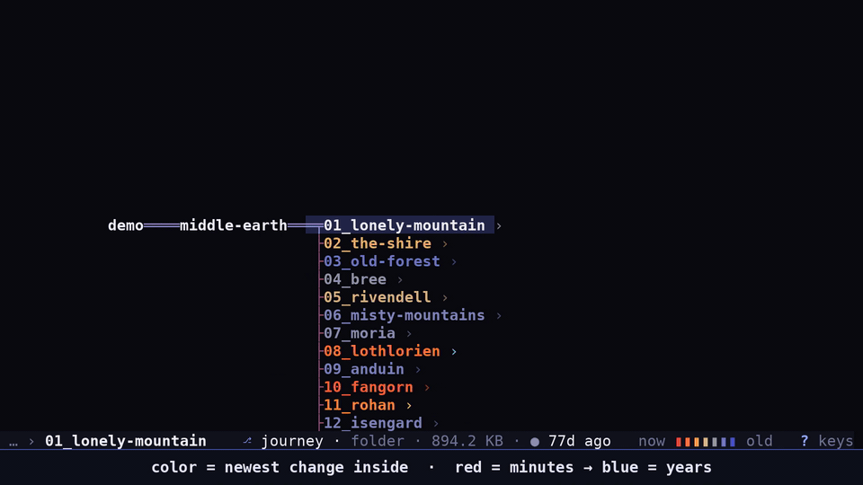

<div align="center">

# tb

**A horizontal tree file browser for the terminal.**
The tree grows left → right, every folder you open fans out as a new column,
and color tells you where work happened recently.

[](https://github.com/freakinfrick/tree-browser/actions/workflows/ci.yml)
[](#license)
[](https://www.rust-lang.org)


<a href="docs/demo.mp4"></a>

<sub>20-second preview · <a href="docs/demo.mp4">full demo video (56 s, 1080p60)</a></sub>

</div>

## Highlights

- **Many branches open at once.** Open folders stay open side by side, joined by elbow connectors, like
  [Conrad Barski's](http://www.lisperati.com/) file browser that inspired it.
- **Heat colors from recursive mtime.** A folder is colored by the newest change *anywhere* inside it,
  so you can spot where the action is from the top of the tree.
- **A fixed selection line.** Root → cursor is always one straight line through mid-screen.
  Moving up and down scrolls the column through the line; the tree moves, the selector doesn't.
- **Physics-driven motion.** Every node rides a critically damped spring: folders unfurl and fold back,
  siblings glide aside, and connectors re-route every frame. 60 fps while moving, zero frames when idle.
- **Rich previews.** Markdown through `glow`, code through `bat`, and images and PDF pages as real pictures
  over kitty, sixel or iTerm2 graphics, with a half-block fallback for any truecolor terminal.
- **Shell without leaving.** `!` runs a command in the selected folder, `s` opens a shell there, and
  `q` can leave your shell `cd`'d to wherever you ended up.

## Install

```sh
cargo install --git https://github.com/freakinfrick/tree-browser
```

or from a clone:

```sh
git clone https://github.com/freakinfrick/tree-browser
cd tree-browser
cargo install --path .     # puts `tb` in ~/.cargo/bin
```

**Requirements:** Rust 1.88+, a Unix-like OS (Linux, macOS, BSD; Windows isn't supported) and a
truecolor terminal. Previews use these tools from `PATH` when they're installed:

| Tool | Used for |
|---|---|
| [`bat`](https://github.com/sharkdp/bat) | syntax-highlighted text |
| [`glow`](https://github.com/charmbracelet/glow) | rendered markdown |
| `file` | describing binaries |
| `pdfinfo`, `pdftoppm` ([poppler](https://poppler.freedesktop.org/)) | PDF pages |
| `convert` ([ImageMagick](https://imagemagick.org/)) | image formats the `image` crate can't decode |

## Usage

```sh
tb [DIR]                  # default: current dir; starts rooted at DIR's parent
tb --cwd-file PATH [DIR]  # on q, write the selected folder to PATH
```

### Keys

| Key | Action |
|---|---|
| `j` `k` / `↓` `↑` | move down / up |
| `J` `K` / `PgDn` `PgUp` | jump 10 |
| `g` `G` / `Home` `End` | first / last |
| `l` `→` `Enter` | open: expand a folder, preview a file |
| `h` `←` | back to the parent |
| `Space` `Tab` | fold / unfold |
| `/` | find in the current column as you type; `Enter` opens the match, `Esc` goes back |
| `Tab` `↓` / `⇧Tab` `↑` | while finding: next / previous match (`↑` on an empty line recalls the last find) |
| `n` `N` | next / previous match of the last find |
| `-` `Backspace` | re-root one level up |
| `c` | collapse everything off the cursor path |
| `.` | show / hide dotfiles (hidden by default) |
| `r` | reload |
| `!` | run a shell command in the selected folder |
| `s` | open a shell in the selected folder |
| `?` | help overlay |
| `q` | quit (and `cd` there, with the shell integration below) |
| `Esc` `Ctrl-C` | quit and stay where you were |

**Mouse:** click selects, click again opens. The wheel scrolls the column under the pointer: over a parent
or child column on the line, the first tick takes that column over (a faint pill marks it on hover) and
the next ones scroll it.

**In a preview:** `j` `k`, `Space` `PgDn`, `Ctrl-D` `Ctrl-U`, `g` `G` scroll text; for images and PDFs
`j` `k` `Space` flip pages and `g` `G` jump to the first / last. `i` switches between pixels and
half-blocks. `q` `Esc` `h` close.

## Color = recency

Files are colored by when they were last modified. Folders are colored by the newest modification
*anywhere inside*, walked recursively on a background thread and capped at 50k entries (a trailing
`~` means the cap was hit, so the color may be too cold).

The gradient is continuous in log-time:

**red** (minutes) → **orange** (hours) → **tan** (days) → **grey** (weeks) → **slate** (a year) → **blue** (5 y+)

Colors cross-fade when heat data lands instead of popping. White marks the cursor path and dim
marks branches off it. The line itself is a double "tube" with proper junctions; every other branch
is tinted by the heat of the folder it grows from, a light sweeps along the line into the cursor on
each move, and closed folders carry a small `›` bud.

## Shell integration

`!` opens a command line in the status bar. `Enter` runs it in the selected folder (a file's own
folder) through `$SHELL -ic`, so aliases and rc functions work, and `$f` is the selected path
(`!vim $f`). `s` opens a full interactive shell there instead.

Either way tb hands over the terminal and comes back exactly where it was when the program exits,
with that folder reloaded. One-liners that finish in under 3 s wait for a key so you can read their
output. In the prompt, `↑` `↓` recall earlier commands, `Ctrl-U` `Ctrl-W` erase, and `Esc` cancels.
`Ctrl-Z` inside a `!` command ends that program rather than pausing it (its shell exits underneath
it); inside `s` it's ordinary job control.

To make `q` leave your shell in the folder you ended on, source the wrapper from `~/.bashrc`:

```sh
source /path/to/tree-browser/tb.bash
```

`Esc` and `Ctrl-C` still leave the shell where it was. The wrapper is a thin layer over
`tb --cwd-file`, so porting it to another shell is a few lines.

## Image and PDF previews

Images (png, jpg, gif, webp, bmp, tiff, ico, svg, avif, heic, …) and PDFs preview as pictures, PDFs one
page at a time. tb uses whatever graphics protocol the terminal answers to at startup:

| Terminal | Protocol |
|---|---|
| Ghostty, Kitty | kitty graphics |
| terminals with sixel support | sixel |
| iTerm2 | iTerm2 inline images |
| anything else with truecolor (tmux, Termius, …) | Unicode half-blocks |

Inside tmux the query is skipped and half-blocks are used. Inside herdr, tb starts in half-blocks
because herdr claims kitty support for every attached client whatever terminal it draws into; press
`i`, or set `TB_GRAPHICS=kitty`, when that terminal really is Ghostty or Kitty.

To override the detection, set `TB_GRAPHICS` to `kitty`, `sixel`, `iterm2`, `halfblocks` or `off`
(captions only).

## Demo

The video above was recorded from the real binary, not mocked up. `demo/` has the whole pipeline:
a Middle-earth fixture tree with staggered mtimes, a tmux-driven recorder that captures the
terminal about 270 times a second, and a renderer that turns the captures into 1080p frames for
ffmpeg. See [`demo/README.md`](demo/README.md) to rebuild it.

## License

Licensed under either of [Apache License, Version 2.0](LICENSE-APACHE) or
[MIT license](LICENSE-MIT), at your option.

The demo fixture under `demo/` is a parody of Tolkien's Middle-earth for showing tb off. It isn't
part of the program and isn't covered by the above; the images it downloads carry their own
Wikimedia Commons licenses (see [`demo/README.md`](demo/README.md)).
